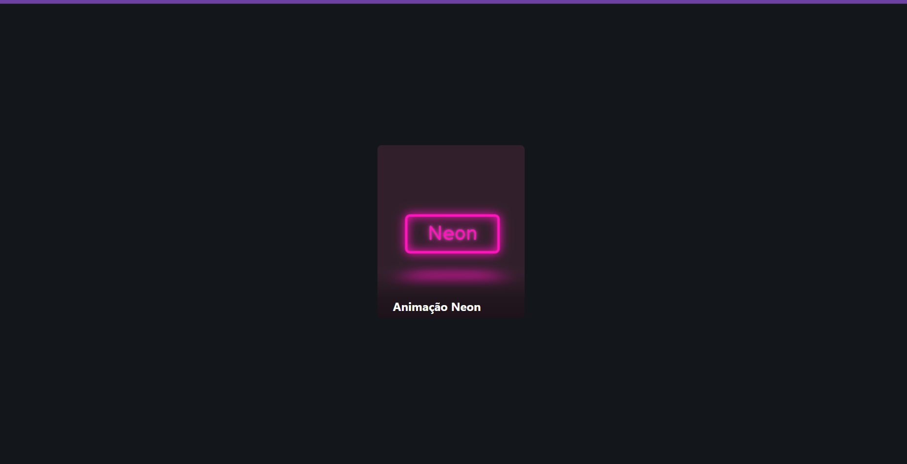

# 

<h1 align="center">Great Card</h1>

## 💻 Sobre o projeto 

Projeto seguindo os outros repositórios, com uma nova animação usando 20% de HTML e 80% de CSS/CSS3 
Novas features: variáveis, pseudo-variáveis, hierarquia de váriaveis e SCSS.

  

